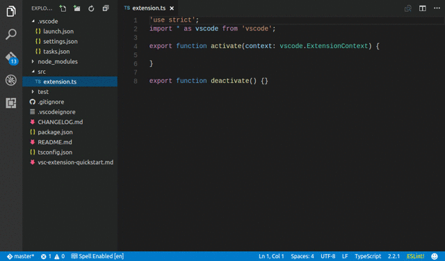
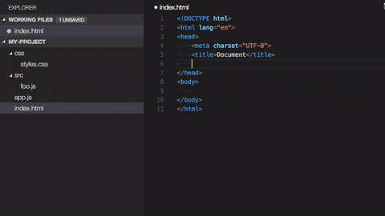
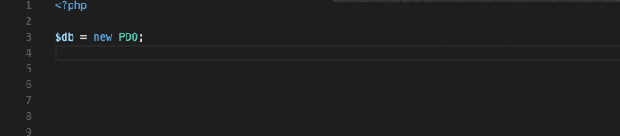

<p align="center">


</p>

<p><br></p>

## LARA PACK

---

<p><a title="IQBAL HASAN" href="https://iqbalhasan.dev">Lara Pack</a> is a Official VS Code Laravel Development Environment Extension Pack By <a title="IQBAL HASAN"  href="https://iqbalhasan.dev">IQBAL HASAN</a> ! Lara Pack is a collection of popular extensions that can help write, test and debug Laravel applications in Visual Studio Code.Lara Pack contains all the necessary extensions of html, css, js, vue, node, axios, php and laravel.</p>

---

## Getting started

You can install this awesome theme through the [Visual Studio Code Marketplace](https://marketplace.visualstudio.com/items?itemName=iqbalhasandev.lara-pack).

### Prerequisites

This theme is compatible for VS Code version 1.56.0+

### Installation

Launch _Quick Open_:

-  <a href="https://code.visualstudio.com/shortcuts/keyboard-shortcuts-linux.pdf">Linux</a> `Ctrl+P`
-  <a href="https://code.visualstudio.com/shortcuts/keyboard-shortcuts-macos.pdf">macOS</a> `⌘P`
-  <a href="https://code.visualstudio.com/shortcuts/keyboard-shortcuts-windows.pdf">Windows</a> `Ctrl+P`

Paste the following command and press `Enter`:

```shell
ext install lara-pack
```

And pick the one by **IQBAL HASAN** as author.

---

## Extensions Included

By installing Lara-Pack, the following extensions are installed:

<!-- VSCode Advanced New File -->

- [📦 VSCode Advanced New File ](https://marketplace.visualstudio.com/items?itemName=patbenatar.advanced-new-file)

  - Fuzzy-matching autocomplete to create new file relative to existing path
  - Create new directories while creating a new file
  - Create a directory instead of a file by suffixing the file path with / as in somedirectory/ to create the directory
  - Ignores gitignored and workspace files.exclude settings.
  - Additional option of adding advancedNewFile.exclude settings to workspace settings just like native files.exlude except it explicitly effects AdvancedNewFile plugin only.
  - Control the order of top convenient options ("last selection", "current file", etc) via config setting advancedNewFile.convenienceOptions.
  - ## Usage

        * Command palette: "Advanced New File"
        * Keyboard shortcut: cmd+alt+n (Mac), ctrl+alt+n (Win, Linux)

    

    <!-- Auto Rename Tag -->

- [📦 Auto Rename Tag ](https://marketplace.visualstudio.com/items?itemName=formulahendry.auto-rename-tag)

  - When you rename one HTML/XML tag, automatically rename the paired HTML/XML tag
  - ## Usage

    

    <!-- axios snippets -->

- [📦 axios snippets ](https://marketplace.visualstudio.com/items?itemName=presidentma.axios-snippets)

  - Axios Snippets support in .vue, .js, .html , .ts.

    <!-- Beautify -->

- [📦 Beautify ](https://marketplace.visualstudio.com/items?itemName=hookyqr.beautify)

  - Beautify javascript, JSON, CSS, Sass, and HTML in Visual Studio Code.

    <!-- Better Comments -->

- [📦 Better Comments ](https://marketplace.visualstudio.com/items?itemName=aaron-bond.better-comments)

  - The Better Comments extension will help you create more human-friendly comments in your code.
    With this extension, you will be able to categorise your annotations into:

    - Alerts
    - Queries
    - TODOs
    - Highlights
    - Commented out code can also be styled to make it clear the code shouldn't be there Any other comment styles you'd like can be specified in the settings

    

    <!--Better PHPUnit -->

- [📦 Better PHPUnit ](https://marketplace.visualstudio.com/items?itemName=calebporzio.better-phpunit)

  - Better PHPUnit is the most popular, cleanest, and fastest PHPUnit runner for VS Code.

    - Color output!
    - Run individual methods by placing your cursor anywhere in/on the method
    - Test failures are displayed in the "Problems" panel for quick access

  - ## Usage
  - Run a test method:

    - Place your cursor in/on the method you want to run
    - Open the command menu: `cmd+shift+p`
    - Select: `Better PHPUnit: run`

  - Run a test file:

    - Open the command menu: `cmd+shift+p`
    - Select: `Better PHPUnit: run-file`

  - Run the entire suite:

    - Open the command menu: `cmd+shift+p`
    - Select: `Better PHPUnit: run suite`

  - Run the previous test:

    - Open the command menu: `cmd+shift+p`
    - Select: `Better PHPUnit: run previous

    

- [📦 Bracket Pair Colorizer ](https://marketplace.visualstudio.com/items?itemName=coenraads.bracket-pair-colorizer)

  - This extension allows matching brackets to be identified with colours. The user can define which characters to match, and which colours to use.

    

- [📦 Code Spell Checker ](https://marketplace.visualstudio.com/items?itemName=streetsidesoftware.code-spell-checker)

  - A basic spell checker that works well with camelCase code.

  - The goal of this spell checker is to help catch common spelling errors while keeping the number of false positives low.

    

- [📦 CSS Formatter ](https://marketplace.visualstudio.com/items?itemName=aeschli.vscode-css-formatter)

  - This extension adds formatting to CSS.

- [📦 css-auto-prefix](https://marketplace.visualstudio.com/items?itemName=sporiley.css-auto-prefix)

  - This tool, although currently usable to an extent, is by no means completed and still requires a lot of work to be finalized. If this freaks you out, please stick around until a later, more stable version is released. Thanks!
  - ## Usage

    - Works both for indented and single-line CSS styles. To activate it, just Ctrl+Shift+P into the workbench command window and type "Auto Prefix"

    

- [📦 EditorConfig for VS Code](https://marketplace.visualstudio.com/items?itemName=editorconfig.editorconfig)

  - This plugin attempts to override user/workspace settings with settings found in `.editorconfig` files. No additional or vscode-specific files are required. As with any EditorConfig plugin, if root=true is not specified, EditorConfig will continue to look for an `.editorconfig` file outside of the project.

  - ## Supported Properties

    - `indent_style`
    - `indent_size`
    - `tab_width`
    - `end_of_line` (on save)
    - `insert_final_newline` (on save)
    - `trim_trailing_whitespace` (on save)

- [📦 ESLint ](https://marketplace.visualstudio.com/items?itemName=dbaeumer.vscode-eslint)

  - The extension uses the ESLint library installed in the opened workspace folder. If the folder doesn't provide one the extension looks for a global install version. If you haven't installed ESLint either locally or globally do so by running npm install eslint in the workspace folder for a local install or npm install -g eslint for a global install.

  - On new folders you might also need to create a .eslintrc configuration file. You can do this by either using the VS Code command Create ESLint configuration or by running the eslint command in a terminal. If you have installed ESLint globally (see above) then run eslint --init in a terminal. If you have installed ESLint locally then run .\node_modules\.bin\eslint --init under Windows and ./node_modules/.bin/eslint --init under Linux and Mac.

- [📦 File Utils ](https://marketplace.visualstudio.com/items?itemName=sleistner.vscode-fileutils)

  - A convenient way of creating, duplicating, moving, renaming, deleting files and directories.
  - ## Usage

    - Bring up the command palette, and select "File Utils: ".
    - Select one of the commands mentioned below.
    - Press [Enter] to confirm, or [Escape] to cancel.

    

- [📦 gitignore ](https://marketplace.visualstudio.com/items?itemName=codezombiech.gitignore)

  - A extension for Visual Studio Code that assists you in working with .gitignore files.

  - Features
    - Language support for .gitignore files
    - Add local .gitignore by pulling file from the the github/gitignore repository.
  - ## Usage
    - Start command palette (with Ctrl+Shift+P or F1) and start typing Add gitignore

- [📦 GitLens — Git supercharged ](https://marketplace.visualstudio.com/items?itemName=eamodio.gitlens)

  - GitLens supercharges the Git capabilities built into Visual Studio Code. It helps you to visualize code authorship at a glance via Git blame annotations and code lens, seamlessly navigate and explore Git repositories, gain valuable insights via powerful comparison commands, and so much more.

    

- [📦 Guides ](https://marketplace.visualstudio.com/items?itemName=spywhere.guides)

  - A Visual Studio Code extension for more guide lines

  - How **Guides** different from built-in indentation guides?

    - Stack and Active indentation guides
    - Indentation backgrounds
    - Color and style customizations
    - Hide on selection

    

- [📦 Highlight Matching Tag ](https://marketplace.visualstudio.com/items?itemName=vincaslt.highlight-matching-tag)

  - This extension highlights matching opening and/or closing tags. Optionally it also shows path to tag in the status bar. Even though VSCode has some basic tag matching, it's just that - basic. This extension will try to match tags anywhere: from tag attributes, inside of strings, any files, while also providing extensive styling options to customize how tags are highlighted.
  - ## Features

  

- [📦 htmltagwrap ](https://marketplace.visualstudio.com/items?itemName=bradgashler.htmltagwrap)

  - Wraps your selection in HTML tags. Can wrap inline selections and selections that span multiple lines (works with both single selections and multiple selections at once).

  - To use, select one or many chunks of code and press "Alt + W" ("Option + W" for Mac).

  - ## How to Use It
    - Select one or more blocks of text or strings of text.
    - Press Alt + W or Option + W for Mac.
    - Type the tag name you want.

- [📦 Import Cost ](https://marketplace.visualstudio.com/items?itemName=wix.vscode-import-cost)

  - This extension will display inline in the editor the size of the imported package. The extension utilizes webpack with babili-webpack-plugin in order to detect the imported size.
  - Features
    - Calculates the size of imports and requires. Currently supports:
      - Default importing: import Func from 'utils';
      - Entire content importing: import \* as Utils from 'utils';
      - Selective importing: import {Func} from 'utils';
      - Selective importing with alias: import {orig as alias} from 'utils';
      - Submodule importing: import Func from 'utils/Func';
      - Require: const Func = require('utils').Func;
      - Supports both Javascript and Typescript

- [📦 IntelliSense for CSS class names in HTML](https://marketplace.visualstudio.com/items?itemName=zignd.html-css-class-completion)

  - A Visual Studio Code extension that provides CSS class name completion for the HTML class attribute based on the definitions found in your workspace or external files referenced through the link element.

  

  - ## Features
    - Gives you autocompletion for CSS class definitions that can be found in your workspace (defined in CSS files or the in the file types listed in the Supported Language Modes section);
    - Supports external stylesheets referenced through link elements in HTML files;
    - Command to manually re-cache the class definitions used in the autocompletion;
    - User Settings to override which folders and files should be considered or excluded from the caching process.

  

- [📦 Laravel Artisan ](https://marketplace.visualstudio.com/items?itemName=ryannaddy.laravel-artisan)

  - Run Laravel Artisan commands from within Visual Studio Code.

  - ## Features
    - Supports multiple instances of artisan in the same workspace hierarchy
    - Make files (Controllers, Migrations, Models, etc)
    - Run Custom Commands
    - Manage the database
    - Clear Caches
    - Generate Keys
    - View all routes
    - Start/stop a local php server for test purposes
    - Docker support
      

- [📦 Laravel Blade Snippets ](https://marketplace.visualstudio.com/items?itemName=onecentlin.laravel-blade)

  - Laravel blade snippets and syntax highlight support for Visual Studio Code.
  - ## Features
    - Blade syntax highlight
    - Blade snippets
    - Emmet works in blade template
    - Blade formatting
      

- [📦 Laravel Blade Spacer ](https://marketplace.visualstudio.com/items?itemName=austenc.laravel-blade-spacer)

  - An extension to automatically add spacing to blade templating markers.
  - ## Features
    - Supports the following tags:
      - `{{ }}`
      - `{!! !!}`
      - `{{-- --}}`
        

- [📦 Laravel Extra Intellisense ](https://marketplace.visualstudio.com/items?itemName=amiralizadeh9480.laravel-extra-intellisense)

  - This extension provides Laravel routes, views and ... autocomplete for VSCode.
  - ## Autocomplete
    - Route names and route parameters
    - Views and variables
    - Configs
    - Translations and translation parameters
    - Laravel mix function
    - Validation rules
    - View sections and stacks
    - Env
    - Route Middlewares
    - Asset
    - Model Attributes (Beta!)
    - Blade directives
      

- [📦 Laravel goto view](https://marketplace.visualstudio.com/items?itemName=codingyu.laravel-goto-view)

  -

- [📦 Laravel Snippets ](https://marketplace.visualstudio.com/items?itemName=onecentlin.laravel5-snippets)

  - Laravel snippets extension for Visual Studio Code (Support Laravel 5 and above version).
    - Laravel 5.x
    - Laravel 6.x
    - Laravel 7.x
    - Laravel 8.x
  - ## Usage

    - Snippet prefix follows Laravel Facades. For example: Request::, Route::

  - Support Snippet Prefix

    - Auth
    - Broadcast
    - Cache
    - Config
    - Console
    - Cookie
    - Crypt
    - DB
    - Event
    - Form (Laravel Collective Form/Html needs to be installed and available as blade snippets)
    - Hash
    - Helper
    - Log
    - Mail - Contains Mail:: and Mailable:: prefix for mail related settings
    - Passport (Laravel v5.3 - API Authentication)
    - Redirect
    - Relation
    - Request
    - Response
    - Route
    - Schema - Contains Schema:: and Column:: prefix for database related settings
    - Session
    - Storage
    - Str
    - View

      

- [📦 Live Server ](https://marketplace.visualstudio.com/items?itemName=ritwickdey.liveserver)

  - Launch a local development server with live reload feature for static & dynamic pages.

    

- [📦 Material Icon Theme ](https://marketplace.visualstudio.com/items?itemName=pkief.material-icon-theme)

  - Get the Material Design icons into your VS Code.

    

- [📦 Minify ](https://marketplace.visualstudio.com/items?itemName=hookyqr.minify)

  - Minify your js, css and html files to save transmit bandwidth. Calls each of the minifiers directly, allowing settings to be passed:
    - JS: uglify-js v2.7.4
    - CSS: clean-css v3.4.21 \* HTML: html-minifier v3.2.2
  - Run the file minifier with F1 Minify.

- [📦 npm Intellisense](https://marketplace.visualstudio.com/items?itemName=christian-kohler.npm-intellisense)

  - Visual Studio Code plugin that autocompletes npm modules in import statements.
    

- [📦 open in browser](https://marketplace.visualstudio.com/items?itemName=techer.open-in-browser)

  - rewrite the code with TypeScript, now it dependes on a tiny library npm/opn
  - support more browsers: Chromium(Mac only), Firefox Developer Edition(Mac only), Edge(Windows only, sometimes it won't work)
  - you can open any* type of file with the default program, not only *html file.
  - ## How it works?
    - on win32 uses start
    - on darwin uses open
    - otherwise uses ths xdg-open script from freedesktop.org
  - ## Usage

- [📦 Path Intellisense](https://marketplace.visualstudio.com/items?itemName=christian-kohler.path-intellisense)

  - Visual Studio Code plugin that autocompletes filenames.

    

- [📦 php cs fixer](https://marketplace.visualstudio.com/items?itemName=junstyle.php-cs-fixer)

  - This extension simply provides PHP CS Fixer command.
  - ## Usage
    - F1 -> php-cs-fixer: fix this file
    - or keyboard shortcut alt+shift+f vs code default formatter shortcut
    - or right mouse context menu Format Document
    - or right mouse context menu Format Selection
    - or right mouse context menu on explorer php-cs-fixer: fix

- [📦 PHP Debug](https://marketplace.visualstudio.com/items?itemName=felixfbecker.php-debug)

  

- [📦 PHP Intelephense](https://marketplace.visualstudio.com/items?itemName=bmewburn.vscode-intelephense-client)

  - PHP code intelligence for Visual Studio Code
  - Intelephense is a high performance PHP language server packed full of essential features for productive PHP development.
    - Fast camel/underscore case code completion (IntelliSense) for document, workspace and built-in symbols and keywords with automatic addition of use declarations.
    - Detailed signature (parameter) help for document, workspace and built-in constructors, methods, and functions.
    - Rapid workspace wide go to definition support.
    - Workspace wide find all references.
    - Fast camel/underscore case workspace symbol search.
    - Full document symbol search that also powers breadcrumbs and outline UI.
    - Multiple diagnostics for open files via an error tolerant parser and powerful static analysis engine.
    - Lossless PSR-12 compatible document/range formatting. Formats combined HTML/PHP/JS/CSS files too.
    - Embedded HTML/JS/CSS code intelligence.
    - Detailed hover with links to official PHP documentation.
    - Smart highlight of references and keywords.
    - Reads PHPStorm metadata for improved type analysis and suggestions.

- [📦 PHP Namespace Resolver](https://marketplace.visualstudio.com/items?itemName=mehedidracula.php-namespace-resolver)

  - PHP Namespace Resolver can import and expand your class. You can also sort your imported classes by line length or in alphabetical order.

- [📦 Prettier - Code formatter](https://marketplace.visualstudio.com/items?itemName=esbenp.prettier-vscode)

  - Prettier is an opinionated code formatter. It enforces a consistent style by parsing your code and re-printing it with its own rules that take the maximum line length into account, wrapping code when necessary.

- [📦 Remote - WSL](https://marketplace.visualstudio.com/items?itemName=ms-vscode-remote.remote-wsl)

  - The Remote - WSL extension lets you use VS Code on Windows to build Linux applications that run on the Windows Subsystem for Linux (WSL). You get all the productivity of Windows while developing with Linux-based tools, runtimes, and utilities.

- [📦 Slime Theme](https://marketplace.visualstudio.com/items?itemName=smlombardi.slime)

  - A dark syntax/workbench theme forVisual Studio Code based on my Atom theme
  - Optimized for SCSS, HTML, JS, TS, Markdown, and PHP files.

- [📦 Snippets Creator](https://marketplace.visualstudio.com/items?itemName=claudineyqr.snippets-creator)

  - Create snippets quickly from selected code blocks.
  - Automate the creation of snippets with this extension. Simply save code blocks as snippet.
    

- [📦 Txt Syntax](https://marketplace.visualstudio.com/items?itemName=xshrim.txt-syntax)

  - ## Features
    - Highlight syntax for several text files.
    - Open the file under the current cursor through the right-click menu "Open File".
    - Simple folding and outline function.
    - Add codelens for Makefile to make running makefile target easily.
    - Highlight current line.
    - Highlight multiple selected words in all active editors.
    - Filter and focus on lines based on custom regular expressions

- [📦 Vetur](https://marketplace.visualstudio.com/items?itemName=octref.vetur)

  - Vue tooling for VS Code.
    - vls: Vue Language Server
    - vti: Vetur Terminal Interface
    - Docs

- [📦 PHP IntelliSense](https://marketplace.visualstudio.com/items?itemName=felixfbecker.php-intellisense)

  - Advanced PHP IntelliSense for Visual Studio Code.
    

---

<p align="center">Copyright &copy; 2021 <a title="IQBAL HASAN" href="https://iqbalhasan.dev">IQBAL HASAN</a></p>

---
