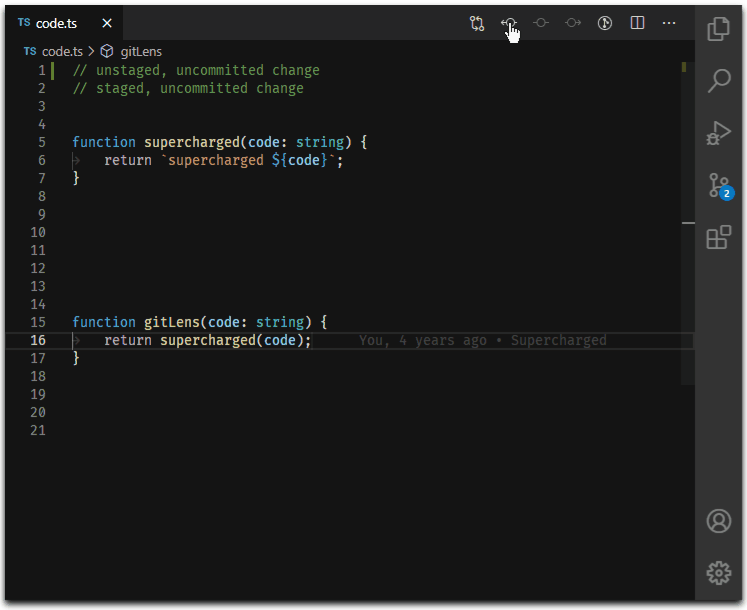

<p align="center">


</p>

<p><br></p>

## LARA PACK

---

<p><a title="IQBAL HASAN" href="https://iqbalhasan.dev">Lara Pack</a> is a Official VS Code Laravel Development Environment Extension Pack By <a title="IQBAL HASAN"  href="https://iqbalhasan.dev">IQBAL HASAN</a> ! Lara Pack is a collection of popular extensions that can help write, test and debug Laravel applications in Visual Studio Code.Lara Pack contains all the necessary extensions of html, css, js, vue, node, axios, php and laravel.</p>

---

## Getting started

You can install this awesome theme through the [Visual Studio Code Marketplace](https://marketplace.visualstudio.com/items?itemName=iqbalhasandev.lara-pack).

### Prerequisites

This theme is compatible for VS Code version 1.56.0+

### Installation

Launch _Quick Open_:

-  <a href="https://code.visualstudio.com/shortcuts/keyboard-shortcuts-linux.pdf">Linux</a> `Ctrl+P`
-  <a href="https://code.visualstudio.com/shortcuts/keyboard-shortcuts-macos.pdf">macOS</a> `⌘P`
-  <a href="https://code.visualstudio.com/shortcuts/keyboard-shortcuts-windows.pdf">Windows</a> `Ctrl+P`

Paste the following command in terminal and press `Enter`:

```shell
code --install-extension iqbalhasandev.lara-pack
```

---

## Extensions Included

By installing Lara-Pack, the following extensions are installed:

  <!-- Auto Close Tag -->

# [📦 Auto Close Tag ](https://marketplace.visualstudio.com/items?itemName=formulahendry.auto-rename-tag)

- Automatically add closing tag when you type in the closing bracket of the opening tag
- After closing tag is inserted, the cursor is between the opening and closing tag
- Set the tag list that would not be auto closed
- Automatically close self-closing tag
- Support auto close tag as Sublime Text 3
- Use Keyboard Shortcut or Command Palette to add close tag manually

## Usage

After typing in the closing bracket of the opening tag, the closing tag will be inserted automatically.


  <!-- Auto Rename Tag -->

# [📦 Auto Rename Tag ](https://marketplace.visualstudio.com/items?itemName=formulahendry.auto-rename-tag)

- When you rename one HTML/XML tag, automatically rename the paired HTML/XML tag

## Usage


# [📦 axios snippets ](https://marketplace.visualstudio.com/items?itemName=presidentma.axios-snippets)

- Axios Snippets support in .vue, .js, .html , .ts.

# [📦 Better Comments ](https://marketplace.visualstudio.com/items?itemName=aaron-bond.better-comments)

- The Better Comments extension will help you create more human-friendly comments in your code.
  With this extension, you will be able to categorise your annotations into:

  - Alerts
  - Queries
  - TODOs
  - Highlights
  - Commented out code can also be styled to make it clear the code shouldn't be there Any other comment styles you'd like can be specified in the settings

  

# [📦 Code Spell Checker ](https://marketplace.visualstudio.com/items?itemName=streetsidesoftware.code-spell-checker)

- A basic spell checker that works well with camelCase code.

- The goal of this spell checker is to help catch common spelling errors while keeping the number of false positives low.

  

# [📦 Composer ](https://marketplace.visualstudio.com/items?itemName=DEVSENSE.composer-php-vscode)

- When you rename one HTML/XML tag, automatically rename the paired HTML/XML tag
- ## Composer.json Editor & IntelliSense

  The composer.json editor is extended with smart actions, code lenses, tooltips, and IntelliSense to autocomplete packages and versions from packagist.org.

  

# [📦 CSS Formatter ](https://marketplace.visualstudio.com/items?itemName=aeschli.vscode-css-formatter)

## VS Code CSS Formatting

This extension adds formatting to CSS.

- Open a CSS file in the editor (status bar should show CSS as mode)
- Use command Format Document

# [📦 css-auto-prefix](https://marketplace.visualstudio.com/items?itemName=sporiley.css-auto-prefix)

- This tool, although currently usable to an extent, is by no means completed and still requires a lot of work to be finalized. If this freaks you out, please stick around until a later, more stable version is released. Thanks!
- ## Usage

  - Works both for indented and single-line CSS styles. To activate it, just Ctrl+Shift+P into the workbench command window and type "Auto Prefix"

  

# [📦 DotENV ](https://marketplace.visualstudio.com/items?itemName=mikestead.dotenv)

## VSCode .env syntax highlighting

- A port of DotENV for vscode.

  

# [📦 ESLint ](https://marketplace.visualstudio.com/items?itemName=dbaeumer.vscode-eslint)

- The extension uses the ESLint library installed in the opened workspace folder. If the folder doesn't provide one the extension looks for a global install version. If you haven't installed ESLint either locally or globally do so by running npm install eslint in the workspace folder for a local install or npm install -g eslint for a global install.

- On new folders you might also need to create a .eslintrc configuration file. You can do this by either using the VS Code command Create ESLint configuration or by running the eslint command in a terminal. If you have installed ESLint globally (see above) then run eslint --init in a terminal. If you have installed ESLint locally then run .\node_modules\.bin\eslint --init under Windows and ./node_modules/.bin/eslint --init under Linux and Mac.

# [📦 GitLens — Git supercharged ](https://marketplace.visualstudio.com/items?itemName=eamodio.gitlens)

- GitLens supercharges the Git capabilities built into Visual Studio Code. It helps you to visualize code authorship at a glance via Git blame annotations and code lens, seamlessly navigate and explore Git repositories, gain valuable insights via powerful comparison commands, and so much more.

  

# [📦 Guides ](https://marketplace.visualstudio.com/items?itemName=spywhere.guides)

- A Visual Studio Code extension for more guide lines

- How **Guides** different from built-in indentation guides?

  - Stack and Active indentation guides
  - Indentation backgrounds
  - Color and style customizations
  - Hide on selection

  

# [📦 HTML CSS Support ](https://marketplace.visualstudio.com/items?itemName=ecmel.vscode-html-css)

## Visual Studio Code CSS Intellisense for HTML

- HTML id and class attribute completion for Visual Studio Code.

## Features

- HTML id and class attribute completion.
- Supports linked and embedded style sheets.
- Supports template inheritance.
- Supports additional style sheets.
- Supports other HTML like languages.
- Validates CSS selectors on demand.

## Usage

You can view a list of id and class attribute suggestions via ctrl + space.

# [📦 Import Cost ](https://marketplace.visualstudio.com/items?itemName=wix.vscode-import-cost)

- This extension will display inline in the editor the size of the imported package. The extension utilizes webpack with babili-webpack-plugin in order to detect the imported size.
- Features
  - Calculates the size of imports and requires. Currently supports:
    - Default importing: import Func from 'utils';
    - Entire content importing: import \* as Utils from 'utils';
    - Selective importing: import {Func} from 'utils';
    - Selective importing with alias: import {orig as alias} from 'utils';
    - Submodule importing: import Func from 'utils/Func';
    - Require: const Func = require('utils').Func;
    - Supports both Javascript and Typescript

# [📦 Highlight Matching Tag ](https://marketplace.visualstudio.com/items?itemName=vincaslt.highlight-matching-tag)

- This extension highlights matching opening and/or closing tags. Optionally it also shows path to tag in the status bar. Even though VSCode has some basic tag matching, it's just that - basic. This extension will try to match tags anywhere: from tag attributes, inside of strings, any files, while also providing extensive styling options to customize how tags are highlighted.
- ## Features


# [📦 IntelliSense for CSS class names in HTML](https://marketplace.visualstudio.com/items?itemName=zignd.html-css-class-completion)

- A Visual Studio Code extension that provides CSS class name completion for the HTML class attribute based on the definitions found in your workspace or external files referenced through the link element.


- ## Features
  - Gives you autocompletion for CSS class definitions that can be found in your workspace (defined in CSS files or the in the file types listed in the Supported Language Modes section);
  - Supports external stylesheets referenced through link elements in HTML files;
  - Command to manually re-cache the class definitions used in the autocompletion;
  - User Settings to override which folders and files should be considered or excluded from the caching process.


# [📦 Laravel Blade formatter ](https://marketplace.visualstudio.com/items?itemName=shufo.vscode-blade-formatter)

## vscode-blade-formatter

An opinionated Blade file formatter for VSCode. Marketplace page is here.

You can also format programmatically with the same syntax using the blade-formatter that this extension relies on.

## Features

- Automatically indent markup inside directives
- Automatically add spacing to blade template markers
- PHP 8 support (null safe operator, named arguments) 🐘
- PSR-2 support (format inside directives)
- Automatically sort Tailwind CSS classes with respect of tailwind.config.js

## Screencast


# [📦 Laravel Blade Snippets ](https://marketplace.visualstudio.com/items?itemName=onecentlin.laravel-blade)

- Laravel blade snippets and syntax highlight support for Visual Studio Code.
- ## Features

  - Blade syntax highlight
  - Blade snippets
  - Emmet works in blade template
  - Blade formatting

  

# [📦 Laravel Blade Spacer ](https://marketplace.visualstudio.com/items?itemName=austenc.laravel-blade-spacer)

- An extension to automatically add spacing to blade templating markers.
- ## Features

  - Supports the following tags:
    - `{{ }}`
    - `{!! !!}`
    - `{{-- --}}`
      

# [📦 Laravel Extra Intellisense ](https://marketplace.visualstudio.com/items?itemName=amiralizadeh9480.laravel-extra-intellisense)

- This extension provides Laravel routes, views and ... autocomplete for VSCode.
- ## Autocomplete
  - Route names and route parameters
  - Views and variables
  - Configs
  - Translations and translation parameters
  - Laravel mix function
  - Validation rules
  - View sections and stacks
  - Env
  - Route Middlewares
  - Asset
  - Model Attributes (Beta!)
  - Blade directives
    

# [📦 Laravel goto view](https://marketplace.visualstudio.com/items?itemName=codingyu.laravel-goto-view)

## How to use

    

# [📦 laravel-goto-components ](https://marketplace.visualstudio.com/items?itemName=naoray.laravel-goto-components)

## How to use

    

# [📦 Minify ](https://marketplace.visualstudio.com/items?itemName=hookyqr.minify)

- Minify your js, css and html files to save transmit bandwidth. Calls each of the minifiers directly, allowing settings to be passed:
  - JS: uglify-js v2.7.4
  - CSS: clean-css v3.4.21 \* HTML: html-minifier v3.2.2
- Run the file minifier with F1 Minify.

# [📦 npm Intellisense](https://marketplace.visualstudio.com/items?itemName=christian-kohler.npm-intellisense)

- Visual Studio Code plugin that autocompletes npm modules in import statements.
  

# [📦 Path Intellisense](https://marketplace.visualstudio.com/items?itemName=christian-kohler.path-intellisense)

- Visual Studio Code plugin that autocompletes filenames.

  

# [📦 PHP](https://marketplace.visualstudio.com/items?itemName=devsense.phptools-vscode)

## PHP Tools for Visual Studio Code

This package extends VS Code with fast code completion, advanced editor features, code fixes, code lenses, code generators, debugger, built-in development web server, test explorer, tests debugger, and workspace-wide code analysis.


# [📦 PHP Intelephense](https://marketplace.visualstudio.com/items?itemName=bmewburn.vscode-intelephense-client)

- PHP code intelligence for Visual Studio Code
- Intelephense is a high performance PHP language server packed full of essential features for productive PHP development.

  - Fast camel/underscore case code completion (IntelliSense) for document, workspace and built-in symbols and keywords with automatic addition of use declarations.
  - Detailed signature (parameter) help for document, workspace and built-in constructors, methods, and functions.
  - Rapid workspace wide go to definition support.
  - Workspace wide find all references.
  - Fast camel/underscore case workspace symbol search.
  - Full document symbol search that also powers breadcrumbs and outline UI.
  - Multiple diagnostics for open files via an error tolerant parser and powerful static analysis engine.
  - Lossless PSR-12 compatible document/range formatting. Formats combined HTML/PHP/JS/CSS files too.
  - Embedded HTML/JS/CSS code intelligence.
  - Detailed hover with links to official PHP documentation.
  - Smart highlight of references and keywords.
  - Reads PHPStorm metadata for improved type analysis and suggestions.

# [📦 PHP Namespace Resolver](https://marketplace.visualstudio.com/items?itemName=mehedidracula.php-namespace-resolver)

- PHP Namespace Resolver can import and expand your class. You can also sort your imported classes by line length or in alphabetical order.

# [📦 Prettier - Code formatter](https://marketplace.visualstudio.com/items?itemName=esbenp.prettier-vscode)

- Prettier is an opinionated code formatter. It enforces a consistent style by parsing your code and re-printing it with its own rules that take the maximum line length into account, wrapping code when necessary.

# [📦 Remote - SSH](https://marketplace.visualstudio.com/items?itemName=ms-vscode-remote.remote-ssh)

## Visual Studio Code Remote - SSH

The Remote - SSH extension lets you use any remote machine with a SSH server as your development environment. This can greatly simplify development and troubleshooting in a wide variety of situations. You can:

- Develop on the same operating system you deploy to or use larger, faster, or more specialized hardware than your local machine.
- Quickly swap between different, remote development environments and safely make updates without worrying about impacting your local machine.
- Access an existing development environment from multiple machines or locations.
- Debug an application running somewhere else such as a customer site or in the cloud.

No source code needs to be on your local machine to gain these benefits since the extension runs commands and other extensions directly on the remote machine. You can open any folder on the remote machine and work with it just as you would if the folder were on your own machine.


# [📦 Remote - SSH: Editing Configuration Files](https://marketplace.visualstudio.com/items?itemName=ms-vscode-remote.remote-ssh-edit)

## Visual Studio Code Remote - SSH: Editing Configuration Files

The Remote - SSH extension lets you use any remote machine with a SSH server as your development environment.

This extension complements the Remote - SSH extension with syntax colorization, keyword intellisense, and simple snippets when editing SSH configuration files.

If you already have an extension that provides this functionality, you can disable this extension.

# [📦 Remote Explorer](https://marketplace.visualstudio.com/items?itemName=ms-vscode.remote-explorer)

## Visual Studio Code Remote Explorer

The Remote - SSH and Remote - Tunnels extensions let you use any remote machine as your development environment.

This extension complements the Remote - SSH and Remote Tunnels extensions by enabling the Remote Explorer view that shows a list of remote machines available to connect to.

# [📦 Snippets Creator](https://marketplace.visualstudio.com/items?itemName=claudineyqr.snippets-creator)

- Create snippets quickly from selected code blocks.
- Automate the creation of snippets with this extension. Simply save code blocks as snippet.
  

# [📦 Txt Syntax](https://marketplace.visualstudio.com/items?itemName=xshrim.txt-syntax)

- ## Features
  - Highlight syntax for several text files.
  - Open the file under the current cursor through the right-click menu "Open File".
  - Simple folding and outline function.
  - Add codelens for Makefile to make running makefile target easily.
  - Highlight current line.
  - Highlight multiple selected words in all active editors.
  - Filter and focus on lines based on custom regular expressions

# [📦 Vue Language Features (Volar) ](https://marketplace.visualstudio.com/items?itemName=vue.volar)

Vue Language Features is a language support extension built for Vue, Vitepress and petite-vue. this is based on @vue/reactivity to calculate everything on-demand, to implement native TypeScript language service level performance.

# [📦 gitignore ](https://marketplace.visualstudio.com/items?itemName=codezombiech.gitignore)

- A extension for Visual Studio Code that assists you in working with .gitignore files.

- Features
  - Language support for .gitignore files
  - Add local .gitignore by pulling file from the the github/gitignore repository.

## Usage

- Start command palette (with Ctrl+Shift+P or F1) and start typing Add gitignore

# [📦 htmltagwrap ](https://marketplace.visualstudio.com/items?itemName=bradgashler.htmltagwrap)

- Wraps your selection in HTML tags. Can wrap inline selections and selections that span multiple lines (works with both single selections and multiple selections at once).

- To use, select one or many chunks of code and press "Alt + W" ("Option + W" for Mac).

- ## How to Use It

  - Select one or more blocks of text or strings of text.
  - Press Alt + W or Option + W for Mac.
  - Type the tag name you want.

- ***

<p align="center">Copyright &copy; 2021 <a title="IQBAL HASAN" href="https://iqbalhasan.dev">IQBAL HASAN</a></p>

---
